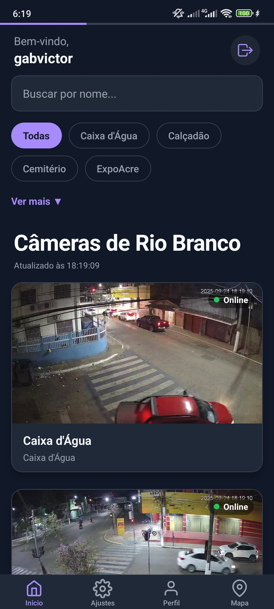
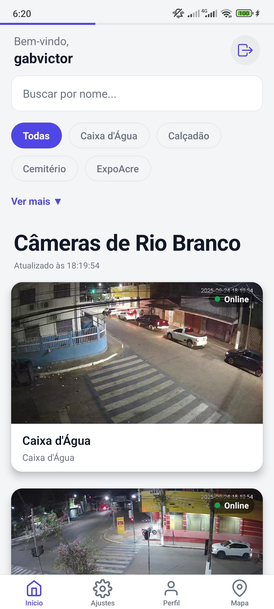

# 📷 app-cameras-rio-branco

[](https://expo.dev/)
[](https://reactnative.dev/)
[](https://www.typescriptlang.org/)
[](./LICENSE)

[](https://github.com/gabvictor/app-cameras-rio-branco/stargazers)
[](https://github.com/gabvictor/app-cameras-rio-branco/forks)
[](https://github.com/gabvictor/app-cameras-rio-branco/issues)
[](https://github.com/gabvictor/app-cameras-rio-branco/commits/main)

Aplicativo mobile para visualização de **câmeras públicas de Rio Branco**.  
Desenvolvido com **Expo + React Native + TypeScript**.  

---

## 📱 Preview

| Tela Inicial | Visualização de Câmera | Tema Escuro/Claro |
|--------------|-------------------------|-------------------|
|  |  |  |

---

## 🧭 Sumário

- [Visão Geral](#-visão-geral)  
- [Funcionalidades](#-funcionalidades)  
- [Tecnologias](#-tecnologias)  
- [Instalação](#-instalação)  
- [Execução](#-execução)  
- [Estrutura de Pastas](#-estrutura-de-pastas)  
- [Contribuição](#-contribuição)  
- [Licença](#-licença)  

---

## 🌎 Visão Geral

O projeto tem como objetivo disponibilizar um **aplicativo simples e prático** para visualizar câmeras instaladas em pontos estratégicos de **Rio Branco**.

- 🚦 Acompanhar trânsito em tempo real  
- 👀 Visualizar diferentes locais da cidade  
- 📡 Atualização em tempo real das câmeras  

---

## ⚡ Funcionalidades

✔️ Listagem de câmeras públicas disponíveis  
✔️ Visualização ao vivo  
✔️ Suporte a tema claro/escuro  
✔️ Interface responsiva  

---

## 🛠 Tecnologias

- [Expo](https://expo.dev/)  
- [React Native](https://reactnative.dev/)  
- [TypeScript](https://www.typescriptlang.org/)  
- [Context API](https://react.dev/reference/react/useContext)  
- [React Hooks](https://react.dev/reference/react/hooks)  

---

## 💻 Instalação

```bash
# Clone o repositório
git clone https://github.com/gabvictor/app-cameras-rio-branco.git

# Acesse a pasta
cd app-cameras-rio-branco

# Instale as dependências
npm install
# ou
yarn install
▶️ Execução
bash
Copiar código
# Iniciar o Expo
npx expo start
Isso abrirá o painel do Expo Developer Tools.
Você pode rodar no emulador Android/iOS ou testar direto no celular com o app Expo Go.

📂 Estrutura de Pastas
bash
Copiar código
├── app/              # Rotas principais
├── assets/           # Ícones, imagens e fontes
├── components/       # Componentes reutilizáveis
├── hooks/            # Hooks customizados
├── scripts/          # Scripts auxiliares
├── src/              # Tipos e utilitários
├── package.json
├── tsconfig.json
├── app.json
└── README.md
🤝 Contribuição
Contribuições são bem-vindas!

Faça um fork do projeto

Crie uma branch: git checkout -b minha-feature

Commit suas alterações: git commit -m "feat: minha nova feature"

Envie: git push origin minha-feature

Abra um Pull Request 🚀

📜 Licença
Este projeto está licenciado sob a licença MIT – veja o arquivo LICENSE para detalhes.

👨‍💻 Autor
Desenvolvido por Gabriel Victor.

GitHub: @gabvictor
